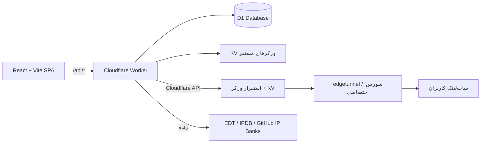

<div align="center">

# ⚡ میلی‌کانفیگ پرو

### پنل حرفه‌ای مدیریت، استقرار و توزیع کانفیگ روی Cloudflare Workers

**بدون Supabase • بک‌اند کامل روی Workers + D1 • همه‌چیز در یک مخزن**

[](https://github.com/miladjahani/miliconfigpro-v1/stargazers)
[](https://github.com/miladjahani/miliconfigpro-v1/network/members)
[](https://github.com/miladjahani/miliconfigpro-v1/commits/main)
[](https://workers.cloudflare.com)
[](https://developers.cloudflare.com/d1/)
[](https://www.typescriptlang.org)
[](https://react.dev)

[⭐ ستاره بدهید](https://github.com/miladjahani/miliconfigpro-v1/stargazers) · [🍴 فورک کنید](https://github.com/miladjahani/miliconfigpro-v1/fork) · [🐞 گزارش باگ](https://github.com/miladjahani/miliconfigpro-v1/issues/new) · [🚀 استقرار سریع](#-شروع-سریع)

</div>

---

<div align="center">

<a href="https://github.com/miladjahani/miliconfigpro-v1">
  
</a>
&nbsp;
<a href="https://github.com/miladjahani/miliconfigpro-v1/fork">
  
</a>
&nbsp;
<a href="https://deploy.workers.cloudflare.com/?url=https://github.com/miladjahani/miliconfigpro-v1">
  
</a>

</div>

---

## 🎯 این چیست؟

میلی‌کانفیگ پرو یک **پنل تحت وب** برای مدیریت کامل زیرساخت کانفیگ شما روی کلودفلر است:

- 🚀 **استقرار ورکر با یک کلیک** — edgetunnel و سورس اختصاصی، با ساخت خودکار KV و UUID
- 👥 **کاربران اختصاصی برای هر ورکر** — هر کاربر ساب، کشور IP، فرگمنت، سقف حجم و تنظیمات منحصربه‌فرد خودش را دارد
- 🧠 **موتور پارسر جهانی** — هر فرمت سابی (base64، sing-box JSON، Clash YAML، حتی HTML) را می‌خواند؛ چند لینک همزمان merge و dedupe می‌شوند
- 🌍 **IP واقعی هر کشور، زنده** — متصل به اکوسیستم EDT (`ipdb.api.030101.xyz`) + بانک‌های Cloudflare رسمی و TheSpeedX
- 📶 **اسکنر و بهینه‌ساز** — پینگ TCP واقعی، تست سرعت، حذف نودهای مرده و ساب بهینه‌شده
- 💉 **تزریق IP و پروکسی** — IP ثابت ورود، زنجیره HTTP/SOCKS5، فرگمنت دقیق برای اپراتورهای ایران، WARP و دور زدن تحریم (جمنی/OpenAI)
- 📱 **افزودن یک‌کلیکی به کلاینت** — v2rayNG، Clash Meta، sing-box، Hiddify، Streisand با QR کد و صفحهٔ وضعیت عمومی
- 🤖 **ربات تلگرام** — هشدار مصرف و مدیریت از داخل تلگرام
- 📊 **سهمیه‌بندی** — سقف گیگ ماهانه، سقف درخواست، حد دستگاه همزمان، انقضا و ریست دوره‌ای برای هر کاربر
- 💡 **راهنمای زنده** — اولین کلیک روی هر دکمه، خودش را توضیح می‌دهد

---

## 🗺️ معماری



| لایه | تکنولوژی | محل |
|---|---|---|
| فرانت‌اند | React 18 + Vite + Tailwind + shadcn | `src/` |
| بک‌اند | Cloudflare Worker (TypeScript) | `worker/` |
| دیتابیس | Cloudflare D1 (SQLite) | `d1/schema.sql` |
| موتور پارسر | universal multi-format | `worker/parser.ts` |
| استقرار ورکر | Cloudflare REST API | `worker/deploy.ts` |

---

## 🚀 شروع سریع

### راه اول — استقرار با Cloudflare Builds (پیشنهادی)

1. مخزن را **فورک** کنید
2. در Cloudflare یک Worker جدید بسازید و به فورک خود وصل کنید
3. یک بار دیتابیس را بسازید:

```bash
npx wrangler d1 create miliconfig-pro
# → database_id را در wrangler.toml جایگزین REPLACE_WITH_YOUR_D1_DATABASE_ID کنید
```

از این به بعد هر `push` به `main` = بیلد + اعمال اسکیمای D1 + استقرار خودکار ✅

### راه دوم — اجرای محلی

```bash
bun install
npm run dev:full   # بیلد + D1 محلی + wrangler dev روی 0.0.0.0:5173
```

### راه سوم — فقط استقرار دستی

```bash
npm run deploy     # بیلد فرانت + اسکیمای D1 (idempotent) + wrangler deploy
```

---

## ✨ قابلیت‌ها در یک نگاه

<table>
<tr><th>بخش</th><th>چه می‌کند؟</th></tr>
<tr><td><b>🚀 استقرار</b></td><td>ورکر edgetunnel یا سورس اختصاصی با UUID و KV خودکار؛ تنظیمات زندهٔ KV مستقیم از پنل (ProxyIP، ECH، فرگمنت، SOCKS5، مسیر تصادفی و...)</td></tr>
<tr><td><b>👥 کاربران</b></td><td>برای هر ورکر: ساب خصوصی، انتخاب کشور با IP واقعی زنده، فرگمنت JSON دقیق، پریست اپراتورهای ایران، Cipher Suite، WARP، دور زدن تحریم، سقف حجم/درخواست/دستگاه، انقضا و ریست دوره‌ای</td></tr>
<tr><td><b>💉 تزریق</b></td><td>IP ثابت ورود، چرخش خودکار IP، زنجیره HTTP/SOCKS5/TURN/SSTP، پارامترهای واقعی edgetunnel (proxyip، globalproxy، ech، ed=2560)</td></tr>
<tr><td><b>📡 اسکنر</b></td><td>بانک‌های زندهٔ IP (EDT، IPDB، Cloudflare رسمی، cf-speedtest، TheSpeedX) + اسکن واقعی TCP روی بازه‌های CIDR + لیست پروکسی EDT-Pages</td></tr>
<tr><td><b>⚡ بهینه‌ساز</b></td><td>پارسر جهانی همهٔ فرمت‌ها، چند لینک همزمان، پینگ واقعی، حذف نود مرده، خروجی Base64 / Clash / Sing-box / Plain</td></tr>
<tr><td><b>📱 تحویل</b></td><td>صفحهٔ وضعیت عمومی هر کاربر با QR کد، دکمه‌های افزودن مستقیم به ۶ کلاینت، تشخیص خودکار فرمت از User-Agent، هدر Subscription-Userinfo</td></tr>
<tr><td><b>🤖 ربات</b></td><td>وب‌هوک تلگرام، هشدار مصرف، مدیریت کاربران از تلگرام</td></tr>
<tr><td><b>💡 راهنما</b></td><td>Coach-mark زندهٔ اولین کلیک روی همهٔ دکمه‌های پنل + راهنمای متنی کامل مسیر کاربری</td></tr>
</table>

---

## 📁 ساختار پروژه

```
├── src/                    # فرانت‌اند (React + Vite)
│   ├── pages/              # داشبورد، ورکرها، کاربران، بهینه‌ساز، اسکنر...
│   ├── components/         # LiveGuide، Layout و...
│   └── lib/                # تایپ‌ها، متن راهنماها، API client
├── worker/                 # بک‌اند Cloudflare Worker
│   ├── index.ts            # روتر /api/*
│   ├── parser.ts           # موتور پارسر جهانی
│   ├── members.ts          # ساب اختصاصی هر کاربر
│   ├── deploy.ts           # استقرار ورکر با API کلودفلر
│   └── ...
├── d1/schema.sql           # اسکیمای کامل دیتابیس
└── wrangler.toml           # کانفیگ Cloudflare
```

---

## 🛠️ توسعه

```bash
bun install        # نصب وابستگی‌ها
npm run dev:full   # اجرای کامل محلی
npx tsc --noEmit   # تایپ‌چک
npm run deploy     # استقرار دستی
```

---

<div align="center">

## ⭐ به ما ستاره بدهید!

اگر میلی‌کانفیگ پرو کارتان را راه انداخت، یک ستاره بزرگ‌ترین حمایت است ⭐

<a href="https://github.com/miladjahani/miliconfigpro-v1/stargazers">
  
</a>

<br/>

<a href="https://github.com/miladjahani/miliconfigpro-v1/stargazers">
  
</a>
&nbsp;
<a href="https://github.com/miladjahani/miliconfigpro-v1/fork">
  
</a>

<sub>ساخته‌شده با ⚡ برای جامعهٔ فارسی‌زبان — بدون هیچ وابستگی به سرویس خارجی، همه‌چیز روی کلودفلر شما</sub>

</div>
