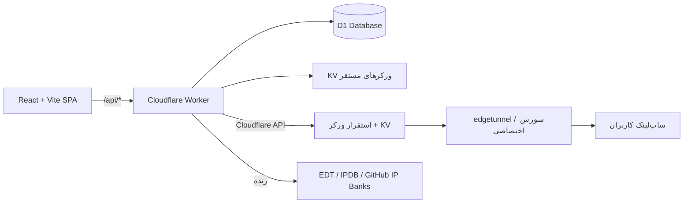

<div align="center">

# ⚡ میلی‌کانفیگ پرو

### پنل حرفه‌ای مدیریت، استقرار و توزیع کانفیگ روی Cloudflare Workers

**بدون Supabase • بک‌اند کامل روی Workers + D1 • همه‌چیز در یک مخزن**

[](https://github.com/miladjahani/miliconfigpro-v1/stargazers)
[](https://github.com/miladjahani/miliconfigpro-v1/network/members)
[](https://github.com/miladjahani/miliconfigpro-v1/commits/main)
[](https://workers.cloudflare.com)
[](https://developers.cloudflare.com/d1/)
[](https://www.typescriptlang.org)
[](https://react.dev)

[⭐ ستاره بدهید](https://github.com/miladjahani/miliconfigpro-v1/stargazers) · [🍴 فورک کنید](https://github.com/miladjahani/miliconfigpro-v1/fork) · [🐞 گزارش باگ](https://github.com/miladjahani/miliconfigpro-v1/issues/new) · [🚀 استقرار سریع](#-شروع-سریع)

[](https://github.com/miladjahani/miliconfigpro-v1/actions/workflows/deploy-pages.yml)
[-f38020?style=flat-square&labelColor=1a1a2e&logo=cloudflare)](https://developers.cloudflare.com/r2/)
[](https://developers.cloudflare.com/workers/configuration/smart-placement/)

</div>

---

<div align="center">

<a href="https://github.com/miladjahani/miliconfigpro-v1">
  
</a>
&nbsp;
<a href="https://github.com/miladjahani/miliconfigpro-v1/fork">
  
</a>
&nbsp;
<a href="https://deploy.workers.cloudflare.com/?url=https://github.com/miladjahani/miliconfigpro-v1">
  
</a>

</div>

---

## 🎯 این چیست؟

میلی‌کانفیگ پرو یک **پنل تحت وب** برای مدیریت کامل زیرساخت کانفیگ شما روی کلودفلر است:

- 🚀 **استقرار ورکر با یک کلیک** — edgetunnel و سورس اختصاصی، با ساخت خودکار KV و UUID
- 👥 **کاربران اختصاصی برای هر ورکر** — هر کاربر ساب، کشور IP، فرگمنت، سقف حجم و تنظیمات منحصربه‌فرد خودش را دارد
- 🧠 **موتور پارسر جهانی** — هر فرمت سابی (base64، sing-box JSON، Clash YAML، حتی HTML) را می‌خواند؛ چند لینک همزمان merge و dedupe می‌شوند
- 🌍 **IP واقعی هر کشور، زنده** — متصل به اکوسیستم EDT (`ipdb.api.030101.xyz`) + بانک‌های Cloudflare رسمی و TheSpeedX
- 📶 **اسکنر و بهینه‌ساز** — پینگ TCP واقعی، تست سرعت، حذف نودهای مرده و ساب بهینه‌شده
- 💉 **تزریق IP و پروکسی** — IP ثابت ورود، زنجیره HTTP/SOCKS5، فرگمنت دقیق برای اپراتورهای ایران، WARP و دور زدن تحریم (جمنی/OpenAI)
- 📱 **افزودن یک‌کلیکی به کلاینت** — v2rayNG، Clash Meta، sing-box، Hiddify، Streisand با QR کد و صفحهٔ وضعیت عمومی
- 🤖 **ربات تلگرام اپ‌مانند** — کیبورد دائمی، صفحات تک‌پیامی، ویزارد استقرار، جست‌وجو، قفل مالکیت با کد اتصال و هشدارهای لحظه‌ای مصرف
- 📊 **سهمیه‌بندی** — سقف گیگ ماهانه، سقف درخواست، حد دستگاه همزمان، انقضا و ریست دوره‌ای برای هر کاربر
- 💡 **راهنمای زنده** — اولین کلیک روی هر دکمه، خودش را توضیح می‌دهد
- 📦 **R2 رایگان خودکار** — با هر استقرار، باکت R2 ساخته و متصل می‌شود (۱۰ گیگ رایگان + egress صفر)
- ⚙️ **gRPC/XHTTP بدون دردسر** — موقع استقرار، gRPC و WebSockets روی همهٔ زون‌ها خودکار روشن می‌شوند
- ⚡ **سرعت** — فایل‌های استاتیک مستقیم از CDN لبه (بدون اجرای ورکر)، Smart Placement کنار D1، کش immutable یک‌ساله

---

## 🗺️ معماری



| لایه | تکنولوژی | محل |
|---|---|---|
| فرانت‌اند | React 18 + Vite + Tailwind + shadcn | `src/` |
| بک‌اند | Cloudflare Worker (TypeScript) | `worker/` |
| دیتابیس | Cloudflare D1 (SQLite) | `d1/schema.sql` |
| موتور پارسر | universal multi-format | `worker/parser.ts` |
| استقرار ورکر | Cloudflare REST API | `worker/deploy.ts` |

---

## 🚀 شروع سریع

### راه اول — استقرار با Cloudflare Builds (پیشنهادی)

1. مخزن را **فورک** کنید
2. در Cloudflare یک Worker جدید بسازید و به فورک خود وصل کنید
3. یک بار دیتابیس را بسازید:

```bash
npx wrangler d1 create miliconfig-pro
# → database_id را در wrangler.toml جایگزین REPLACE_WITH_YOUR_D1_DATABASE_ID کنید
```

از این به بعد هر `push` به `main` = بیلد + اعمال اسکیمای D1 + استقرار خودکار ✅

### راه دوم — اجرای محلی

```bash
bun install
npm run dev:full   # بیلد + D1 محلی + wrangler dev روی 0.0.0.0:5173
```

### راه سوم — فقط استقرار دستی

```bash
npm run deploy     # بیلد فرانت + اسکیمای D1 (idempotent) + wrangler deploy
```

---

## ✨ قابلیت‌ها در یک نگاه

<table>
<tr><th>بخش</th><th>چه می‌کند؟</th></tr>
<tr><td><b>🚀 استقرار</b></td><td>ورکر edgetunnel یا سورس اختصاصی با UUID و KV خودکار؛ تنظیمات زندهٔ KV مستقیم از پنل (ProxyIP، ECH، فرگمنت، SOCKS5، مسیر تصادفی و...)</td></tr>
<tr><td><b>👥 کاربران</b></td><td>برای هر ورکر: ساب خصوصی، انتخاب کشور با IP واقعی زنده، فرگمنت JSON دقیق، پریست اپراتورهای ایران، Cipher Suite، WARP، دور زدن تحریم، سقف حجم/درخواست/دستگاه، انقضا و ریست دوره‌ای</td></tr>
<tr><td><b>💉 تزریق</b></td><td>IP ثابت ورود، چرخش خودکار IP، زنجیره HTTP/SOCKS5/TURN/SSTP، پارامترهای واقعی edgetunnel (proxyip، globalproxy، ech، ed=2560)</td></tr>
<tr><td><b>📡 اسکنر</b></td><td>بانک‌های زندهٔ IP (EDT، IPDB، Cloudflare رسمی، cf-speedtest، TheSpeedX) + اسکن واقعی TCP روی بازه‌های CIDR + لیست پروکسی EDT-Pages</td></tr>
<tr><td><b>⚡ بهینه‌ساز</b></td><td>پارسر جهانی همهٔ فرمت‌ها، چند لینک همزمان، پینگ واقعی، حذف نود مرده، خروجی Base64 / Clash / Sing-box / Plain</td></tr>
<tr><td><b>📱 تحویل</b></td><td>صفحهٔ وضعیت عمومی هر کاربر با QR کد، دکمه‌های افزودن مستقیم به ۶ کلاینت، تشخیص خودکار فرمت از User-Agent، هدر Subscription-Userinfo</td></tr>
<tr><td><b>🤖 ربات</b></td><td>وب‌هوک تلگرام، هشدار مصرف، مدیریت کاربران از تلگرام + کاتالوگ پنل‌ها (<code>/panels</code>)، لیست پنل‌های مستقرشده روی Railway/Render (<code>/servers</code>) و اعلان خودکار لحظهٔ آمادهشدن پنل</td></tr>
<tr><td><b>💡 راهنما</b></td><td>Coach-mark زندهٔ اولین کلیک روی همهٔ دکمه‌های پنل + راهنمای متنی کامل مسیر کاربری</td></tr>
<tr><td><b>📦 R2</b></td><td>باکت R2 رایگان با هر استقرار خودکار ساخته و به ورکر متصل می‌شود — داده‌های سنگین از D1 خارج می‌شوند</td></tr>
<tr><td><b>⚙️ gRPC/XHTTP</b></td><td>روشن‌کردن خودکار gRPC + WebSockets روی زون‌ها موقع استقرار — نودها بدون تداخل با کلودفلر کار می‌کنند</td></tr>
<tr><td><b>⚡ سرعت</b></td><td>استاتیک‌ها از CDN لبه بدون اجرای ورکر + Smart Placement کنار D1 + کش immutable یک‌ساله</td></tr>
<tr><td><b>🧩 چند زیرساخت</b></td><td>استقرار روی Cloudflare (Workers/Pages)، Railway، Render.com و هر VPS با Docker — با کاتالوگ پنل‌های آمادهٔ بررسی‌شده (StanNG v2، PXPANEL، 3X-UI، S-UI، PasarGuard، Remnawave) و تولید خودکار Dockerfile / docker-compose / railway.toml / render.yaml</td></tr>
<tr><td><b>🤖 ربات تلگرام</b></td><td>معماری سه‌لایه (<code>telegram-core</code> / <code>telegram-ui</code> / <code>telegram</code>) — کیبورد دائمی، صفحه‌های تک‌پیامی که درجا ویرایش می‌شوند، ویزارد استقرار (روش ← منبع ← توکن ← تأیید)، جست‌وجو، لینک‌های عمیق <code>?start=workers</code>، قفل مالکیت با کد اتصال یک‌بارمصرف و اعلان لحظه‌ای پنل‌های Railway/Render</td></tr>
</table>

---

## 🧩 کاتالوگ پنل‌ها (Railway · Render.com · VPS)

هر پنلی که می‌توان روی Railway، Render.com یا یک VPS داکری مستقر کرد، در یک فایل مشترک تعریف می‌شود:

```
shared/panels.ts
```

این کاتالوگ هم در بک‌اند (Worker: `railway.ts`، `render.ts`، `index.ts`) و هم در فرانت‌اند (`DeployWizard`، `vps-deploy.ts`) استفاده می‌شود — پس افزودن یک پنل جدید با یک ورودی، بلافاصله در **همهٔ بخش‌های برنامه** (ویزارد استقرار، توکن‌ها، مستندات، ساخت فایل‌های استقرار) ظاهر می‌شود؛ دقیقاً مثل سورس‌های ورکر کلودفلر.

| پنل | مخزن | جامعه | نوع اجرا | مسیر پنل | پورت | هدف‌ها |
|---|---|---|---|---|---|---|
| **StanNG v2** | `youdidking/stanngv2` | 🌍 | Docker (Dockerfile مخزن) | `/login` | 8000 | Railway · Render · VPS |
| **PXPANEL** | `iran-px-panel/pxpanel` | 🇮🇷 | Python / FastAPI | `/dashboard` | 8000 | Railway · Render · VPS |
| **3X-UI** | `MHSanaei/3x-ui` | 🇮🇷 | Docker (ایمیج رسمی) | `/` | 2053 | VPS |
| **S-UI** | `alireza0/s-ui` | 🇮🇷 | Docker (ایمیج رسمی) | `/app/` | 2095 (+2096) | VPS |
| **PasarGuard** | `PasarGuard/panel` | 🇮🇷 | Docker + PostgreSQL | `/` | 8000 | VPS |
| **Remnawave** | `remnawave/backend` | 🇷🇺 | Docker + PostgreSQL + Redis | `/` | 3000 | VPS |
| **Luffy Panel** | `luffy-sh-op/LUFFY_PANEL` | 🌍 | Python / FastAPI (Procfile خودش) | `/` | 8000 | Railway · Render · VPS |
| **WG-Easy** | `wg-easy/wg-easy` | 🌍 | Docker (WireGuard/AmneziaWG) | `/` | 51821 (+51820/udp) | VPS |

### پنل‌های اسکریپتی (نصب مستقیم روی VPS)

بعضی پروژه‌ها مستقیم روی خود هاست نصب می‌شوند (systemd/SSH) و در قالب داکر بالا نمی‌آیند؛ این‌ها در `shared/vps-scripts.ts` هستند و ویزارد **دستور نصب رسمی تأییدشده‌شان** را نشان می‌دهد:

| پروژه | جامعه | روش | آخرین کامیت |
|---|---|---|---|
| `HamedAp/ShahanPanel` (پنل شاهان) | 🇮🇷 | اسکریپت رسمی (`install.sh`) | 2026-09-12 |
| `mack-a/v2ray-agent` | 🇨🇳 | اسکریپت یک‌خطی Xray/sing-box (+ نسخهٔ داکری) | 2026-09-09 |
| `hiddify/Hiddify-Manager` | 🌍 | اسکریپت رسمی مخزن | 2026-09-07 |

> برندهایی که اسمشان زیاد شنیده می‌شود ولی **مخزن عمومی قابل‌تأییدی ندارند** (SLV، RVG، loofi، sanayii، solgx) و همچنین مخازن راکد/۴۰۴، در `EXCLUDED_REPOS`، `EXCLUDED_WORKER_SOURCES` و `UNVERIFIABLE_PANEL_BRANDS` با دلیل ثبت شده‌اند.

**قاعدهٔ افزودن:** هر پنل فقط بعد از **بررسی زندهٔ مخزن** اضافه می‌شود. هر ورودی `lastCommit` (تاریخ آخرین کامیت بالادست) و `verifiedAt` (تاریخ بررسی) دارد و در ویزارد به‌صورت بج «✅ last upstream commit …» نمایش داده می‌شود. مخازنی که راکد بودند (مثلاً `Gozargah/Marzban` با آخرین کامیت ۲۰۲۵-۰۱-۰۹) در فهرست `EXCLUDED_REPOS` با دلیل ثبت شده‌اند تا حذف‌شدنشان تصادفی به نظر نرسد.

برای هر پنل، ویزارد استقرار از این سه روش پشتیبانی می‌کند:

1. **Railway (خودکار)** — پروژه ساخته می‌شود، مخزن به‌عنوان سرویس متصل، متغیرهای محیطی (`ADMIN_PASSWORD`، `SECRET_KEY`، `PORT` و...) ست و دیپلوی اجرا می‌شود.
2. **Render.com (خودکار)** — یک Blueprint (render.yaml) ساخته می‌شود؛ برای پنل داکری `env: docker` و برای پنل پایتونی `env: python` با build/start command مناسب.
3. **VPS (Docker)** — بستهٔ ZIP شامل `docker-compose.yml`، `nginx.conf`، `.env`، `deploy.sh` و `README.md` دانلود می‌شود. برای پنل‌های پایتونی `Dockerfile` هم ساخته می‌شود؛ پنل‌های دارای ایمیج رسمی مستقیم از همان ایمیج بالا می‌آیند و در صورت نیاز، سرویس‌های **PostgreSQL** و **Redis** خودکار به compose اضافه می‌شوند.

> رمز ادمین و کلید سشن در هر استقرار به‌صورت تصادفی ساخته می‌شوند و در متغیرهای محیطی همان سرویس قرار می‌گیرند؛ فقط یک‌بار پس از استقرار نمایش داده می‌شوند.

**افزودن پنل جدید:** یک ورودی به آرایهٔ `PANELS` در `shared/panels.ts` اضافه کنید (مخزن، نوع اجرا، پورت، مسیر پنل و نام متغیرهای محیطی). نیازی به تغییر جای دیگری از کد نیست.

---

## 🌌 NEXUS — نسل جدید ورکر (پیش‌فرض جدید)

یک ورکر کاملاً جدید و مستقل که از صفر برای نیاز امروز طراحی شده — ترکیبی از پنل داخلی هوشمند، نقشهٔ زندهٔ جهانی و مبهم‌سازی پیشرفته:

- 🧠 **موتور هوشمند** — تنظیمات به‌صورت خودکار با توجه به کشور/دیتاسنتر بازدیدکننده بهینه می‌شود (انتخاب بهترین PoP، پورت، transport و فرگمنت)
- 🗺️ **نقشهٔ زندهٔ سراسری** — ۵۷+ دیتاسنتر Cloudflare با مختصات واقعی، محاسبهٔ RTT بر اساس فاصله و نمایش بهترین مسیر برای هر کاربر در هر جای دنیا
- 🛡️ **مبهم‌سازی دو لایه** — قفل و کلیدهای پیکربندی رمزگذاری‌شده + نام توابع غیرقابل‌ردیابی + ناحیهٔ کد طعمه (decoy) برای گمراه‌کردن تحلیل‌گر
- ⚡ **ساب‌نویس خودکار** — خروجی Base64 / Clash / sing-box / Plain با تشخیص خودکار از User-Agent و `?target=`
- 🔐 **پنل داخلی همه‌چیزتمام** — تنظیمات زندهٔ KV (transport، TLS/ECH، فرگمنت، ProxyIP، Cipher)، دو زبانهٔ فارسی/انگلیسی، طراحی آینده‌نگرانه با پس‌زمینهٔ ستاره‌ای متحرک
- 📂 **یک فایل، بدون وابستگی** — کل ورکر (پنل + API + نقشه) در `public/repo/nexus.js` است؛ بدون asset، بدون D1

### نصب NEXUS

**راه اول — از پنل میلی‌کانفیگ:** در صفحهٔ «استقرار ورکر»، منبع را روی **NEXUS** بگذارید و مثل بقیهٔ سورس‌ها مستقر کنید. UUID هم‌ان کلید پنل است: `https://<worker>.workers.dev/<uuid>`

**راه دوم — مستقل:**

```bash
npx wrangler kv namespace create nexus-config
# → id را در public/repo/nexus-wrangler.toml جایگزین REPLACE_WITH_YOUR_KV_NAMESPACE_ID کنید
npx wrangler deploy -c public/repo/nexus-wrangler.toml
```

| متغیر | معنی |
|---|---|
| `u` | UUID ورکر — هم‌کلید بازکردن پنل و هم مسیر ساب (`/<uuid>/sub`) |
| `d` | کلید دوم اختیاری / نام کوتاه |
| KV `C` | تنظیمات زنده زیر کلید `c` (سازگار با پنل میلی‌کانفیگ) |

---

## 📁 ساختار پروژه

```
├── src/                    # فرانت‌اند (React + Vite)
│   ├── pages/              # داشبورد، ورکرها، کاربران، بهینه‌ساز، اسکنر...
│   ├── components/         # LiveGuide، Layout و...
│   └── lib/                # تایپ‌ها، متن راهنماها، API client
├── worker/                 # بک‌اند Cloudflare Worker
│   ├── index.ts            # روتر /api/*
│   ├── parser.ts           # موتور پارسر جهانی
│   ├── members.ts          # ساب اختصاصی هر کاربر
│   ├── deploy.ts           # استقرار ورکر با API کلودفلر
│   └── ...
├── d1/schema.sql           # اسکیمای کامل دیتابیس
└── wrangler.toml           # کانفیگ Cloudflare
```

---

## 🛠️ توسعه

```bash
bun install        # نصب وابستگی‌ها
npm run dev:full   # اجرای کامل محلی
npx tsc --noEmit   # تایپ‌چک
npm run deploy     # استقرار دستی
```

---

<div align="center">

## ⭐ به ما ستاره بدهید!

اگر میلی‌کانفیگ پرو کارتان را راه انداخت، یک ستاره بزرگ‌ترین حمایت است ⭐

<a href="https://github.com/miladjahani/miliconfigpro-v1/stargazers">
  
</a>

<br/>

<a href="https://github.com/miladjahani/miliconfigpro-v1/stargazers">
  
</a>
&nbsp;
<a href="https://github.com/miladjahani/miliconfigpro-v1/fork">
  
</a>

<sub>ساخته‌شده با ⚡ برای جامعهٔ فارسی‌زبان — بدون هیچ وابستگی به سرویس خارجی، همه‌چیز روی کلودفلر شما</sub>

</div>
